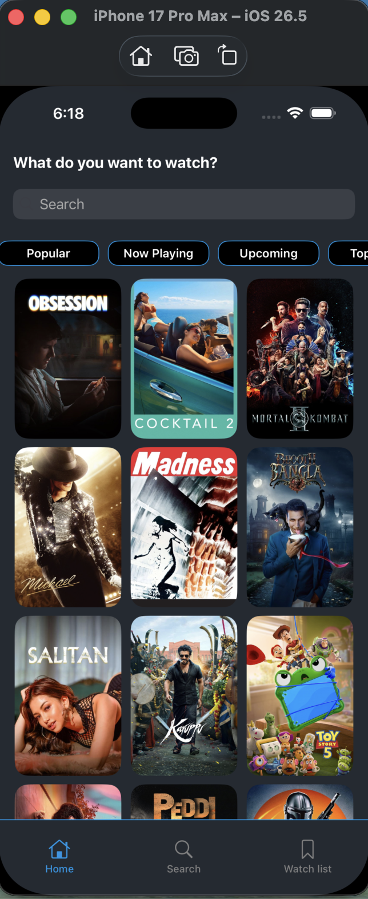

# 🎬 Movies

A clean and modern iOS application for discovering movies, exploring details, reading reviews, and managing your personal watchlist — built with Swift and MVVM architecture.

---

## 📸 Screenshots
 


---

##  Features

-  **Home** — Browse popular, top-rated, and upcoming movies
-  **Search** — Find any movie instantly
-  **Details** — Full movie info including overview, rating, and genres
-  **Cast** — Explore the full cast of each movie
-  **Reviews** — Read audience and critic reviews
-  **Watchlist** — Save movies to watch later
-  **Smooth UI** — Custom tab bar and elegant transitions
---
##  Architecture

This app is built using **MVVM (Model-View-ViewModel)** with **Combine** for reactive data binding.

```
Movies/
├── App Delegate
├── Coordinator          # Navigation logic
├── NetworkManager       # API layer
├── Resources
└── Scenes/
    ├── Home/
    ├── Search/
    ├── Details/
    │   ├── DataModel
    │   ├── ViewModel
    │   └── View/
    │       ├── CastCell
    │       ├── MovieReviewsCell
    │       └── MovieTapCell
    ├── WatchList/
    ├── Splash/
    ├── TapBar/
    └── Extensions/
```

---

##  Tech Stack

| Technology | Usage |
|------------|-------|
| Swift | Primary language |
| UIKit | UI framework |
| Combine | Reactive binding |
| MVVM | Architecture pattern |
| Coordinator | Navigation pattern |
| URLSession | Networking |
| UserDefaults | Local persistence (Watchlist) |

---

##  Requirements

- iOS 15.0+
- Xcode 16.0+
- Swift 5.x
- iPhone & iPad supported

---

##  Getting Started

1. Clone the repository
```bash
git clone https://github.com/ahmedfathymohmed/Movies.git
```

2. Open the project
```bash
cd Movies
open Movies.xcodeproj
```

3. Add your API Key
- Get a free API key from [TMDB](https://www.themoviedb.org/settings/api)
- Add it to `NetworkManager`

4. Build and run on simulator or device ▶️

---

##  API

This app uses the [TMDB API](https://www.themoviedb.org/documentation/api) to fetch movie data.

---

##  Author

**Ahmed Fathy**  
[GitHub](https://github.com/ahmedfathymohmed)

---

##  License

This project is for educational purposes.
